# Sistema de Análise de Perfil de Aprendizado

Plataforma **serverless** que personaliza o ensino para estudantes superdotados e para estudantes com necessidades específicas. Coleta dados por **formulários** (histórico escolar, preferências de aprendizagem, comportamentos observados, indicadores socioemocionais), roda **machine learning** sobre essas respostas e devolve **estratégias pedagógicas** e relatórios — com quatro personas: **educador**, **responsável** (guardian), **estudante** e **admin**.

O princípio central é: **um perfil é rastreado a partir de um formulário preenchido.** O formulário VARK, por exemplo, gera o perfil de aprendizagem V/A/R/K (método de Fleming) e, em seguida, um modelo de ML classifica o perfil automaticamente.

> Documento em **pt-BR** (visão geral para humanos). A documentação de arquitetura em inglês, que é a fonte da verdade do projeto, vive em [`specs/`](./specs/README.md) — comece por ela.

---

## Sumário

- [Arquitetura](#arquitetura)
- [Tecnologias](#tecnologias)
- [Estrutura do repositório](#estrutura-do-repositório)
- [IaC — Infraestrutura como Código](#iac--infraestrutura-como-código)
  - [Divisão de responsabilidades](#divisão-de-responsabilidades)
  - [Terraform — o que cada stack cria](#terraform--o-que-cada-stack-cria)
  - [AWS SAM — o que o template cria](#aws-sam--o-que-o-template-cria)
  - [Nomenclatura dos recursos](#nomenclatura-dos-recursos)
  - [Estado remoto e integração Terraform ↔ SAM](#estado-remoto-e-integração-terraform--sam)
  - [Ordem de deploy](#ordem-de-deploy)
- [Backend](#backend)
  - [Lambdas e rotas](#lambdas-e-rotas)
  - [DynamoDB single-table](#dynamodb-single-table)
  - [Autenticação, RBAC e escopo](#autenticação-rbac-e-escopo)
  - [Engine de formulários](#engine-de-formulários)
  - [Fluxo de envio → predição](#fluxo-de-envio--predição)
  - [LGPD](#lgpd)
- [Machine Learning (100% offline)](#machine-learning-100-offline)
- [Frontend (Angular)](#frontend-angular)
  - [Capturas de tela](#capturas-de-tela)
- [Testes](#testes)
- [Comandos](#comandos)
- [Segurança e repositório público](#segurança-e-repositório-público)
- [Especificações (specs)](#especificações-specs)
- [Referências](#referências)

---

## Arquitetura

Um único domínio CloudFront serve **a SPA e a API** — a SPA em `/*` (S3) e a API em `/api/*` (API Gateway). Isso evita CORS e deixa o sistema pronto para consumo por outros clientes.

```
                          CloudFront  (1 distribuição, 1 domínio)
                         ┌──────────┐
                         │  CDN     │
                         └────┬─────┘
              ┌────────────────┴─────────────────┐
              │ /*                              │ /api/*
              ▼                                 ▼
        ┌──────────┐                    ┌──────────────┐
        │ S3 (front)│                   │ API Gateway  │
        │  estático │                   │  (REST API)  │
        └──────────┘                    └──────┬───────┘
                                                │
                                                ▼
                                    ┌───────────────────────┐
                                    │ 11 Lambdas API        │  ◄── Inference Lambda (Python)
                                    │ (Node.js 22, SAM)     │        (invocação assíncrona)
                                    └──────┬───────────────┘
                     ┌─────────────────────┴───────────────────┐
                     ▼                     ▼                   ▼
              ┌────────────┐        ┌─────────────┐      ┌──────────────┐
              │ DynamoDB   │        │ SQS (fila)  │      │ S3 (files)   │
              │ single-    │        │ de relatórios│     │ relatórios   │
              │ table      │        └──────┬──────┘      └──────────────┘
              └─────▲──────┘               │
                    │                      ▼
        ┌───────────┴────────────┐   ┌──────────────────┐
        │ Lambdas assíncronas    │   │ report-generator │  (Terraform)
        │ (Terraform):            │   └──────────────────┘
        │ • report-generator (SQS)│
        │ • feature-export        │   ┌──────────────────┐
        │   (EventBridge, 02:00)  │   │ S3 (data):       │
        └────────────────────────┘   │ snapshots de ML  │
                                     └──────────────────┘

  ML:  ml/ (Python/scikit-learn) ── offline, na máquina do dev ──► empacota
       model.joblib + meta.json dentro da Inference Lambda
```

## Tecnologias

| Camada | Tecnologia |
|--------|-----------|
| Infra como código | **Terraform** (estado remoto em S3, com lockfile) |
| API | **AWS SAM** · **API Gateway (REST)** · **Node.js 22 (ESM)** |
| Banco de dados | **Amazon DynamoDB** — *single-table design* |
| Arquivos | **Amazon S3** (3 buckets: `files`, `data`, `front`) — SSE, acesso privado, URL pré-assinada |
| Fila assíncrona | **Amazon SQS** (+ DLQ) — só para relatórios |
| Agendamento | **Amazon EventBridge** — exportação noturna de features |
| Frontend | **Angular 21** · **Angular Material** (theming M3) · **Signals** · **Vitest** |
| CDN | **CloudFront** + S3 + OAC + CloudFront Functions |
| ML | **Python 3.12** · **scikit-learn** (Logistic Regression) · **joblib** |
| Segurança | bcrypt, tokens `crypto.randomBytes`, gitleaks, pre-commit, secret-scan CI |

## Estrutura do repositório

```
.
├── terraform/                 # IaC — infra com estado (AWS)
│   ├── aws-bootstrap/         #   bucket de estado do Terraform (uma vez)
│   ├── aws-app/               #   DynamoDB + buckets + SQS + Lambdas assíncronas
│   │   ├── resources/modules/ #     database · files · data · report-queue · feature-export
│   │   └── src/               #     código-fonte das Lambdas assíncronas (.mjs)
│   └── aws-frontend/          #   S3 estático + CloudFront + OAC + funções de borda
│
├── sam-app/                   # IaC — camada de aplicação (AWS SAM)
│   ├── template.yaml          #   API Gateway + 11 Lambdas de API + Lambda de inferência
│   ├── resources.env          #   nomes dos recursos (fonte de verdade, seguro para commit)
│   ├── samconfig.toml         #   nome do stack + overrides
│   ├── Makefile               #   deploy, sync, testes, limpeza do banco
│   ├── src/api/               #   handlers .mjs, engine de formulários, lib (auth/scope/db)
│   ├── src/inference/         #   handler.py + models/<formId>/{model.joblib,meta.json}
│   ├── tests/unit/            #   testes unitários (node --test)
│   └── tests/e2e/             #   suíte e2e contra a API já implantada
│
├── frontend/                  # SPA Angular
│   ├── angular.json, proxy.conf.json
│   └── src/app/
│       ├── core/              #   auth, guards, interceptor, clientes HTTP tipados, polling
│       ├── layout/            #   shell da aplicação (header, navegação por papel)
│       ├── shared/ui/         #   componentes promovidos (>= 2 features)
│       └── features/          #   auth · home · students-list · student-workspace
│                                assessment · observations · recommendations · reports
│                                profile · student-create · admin
│
├── ml/                        # Pipeline de ML OFFLINE (nunca roda na AWS)
│   ├── features/prepare.py    #   carregamento posicional do dataset + vetores de features
│   ├── train/train.py         #   treino + validação cruzada estratificada
│   ├── evaluate/report.py     #   métricas (accuracy, macro-F1, por classe)
│   ├── serve/package.py       #   empacota model.joblib + meta.json na Lambda
│   ├── serve/sanity.py        #   checagens do artefato
│   └── tests/inference_smoke.py
│
├── datasets/vark/             # dataset público (data.csv + citation.txt)
├── specs/                     # documentação de arquitetura (DAG) — ver specs/README.md
├── docs/                      #
├── Makefile                   # orquestrador de deploy/destroy de todo o stack
└── AGENTS.md                  # regras para agentes de código (leia antes de contribuir)
```

---

## IaC — Infraestrutura como Código

A infraestrutura é declarada em **duas ferramentas**, cada uma responsável por um tipo de recurso. Isso é deliberado: recurso **com estado** (banco, bucket, fila) precisa de um ciclo de vida controlado e centralizado; recurso **sem estado** (compute de API) é descartável e revisar por deploy é mais seguro.

### Divisão de responsabilidades

| Ferramenta | Cuida de | Motivo |
|------------|----------|--------|
| **Terraform** | DynamoDB, S3, SQS, Lambdas de processamento, EventBridge, CloudFront | Recurso com estado precisa de um dono único e de um plano explícito de mudança/destruição |
| **AWS SAM** | API Gateway + Lambdas disparadas pela API + Lambda de inferência | Compute efêmero, versionado junto do código (`template.yaml` é a fonte da verdade) |
| **Makefile** (raiz) | A ordem de deploy entre os dois | Nenhuma tool lê a outra; o Makefile passa os valores (exports e `--parameter-overrides`) |

### Terraform — o que cada stack cria

**1) `terraform/aws-bootstrap/`** — executado **uma única vez**, no primeiro deploy.

- Bucket S3 `luidsonl-learning-profile-terraform-state` com **versionamento**, **SSE**, **bloqueio de acesso público** e `lifecycle { prevent_destroy = true }` (é o bucket de estado — nunca pode ser destruído por engano).

**2) `terraform/aws-app/`** — a infraestrutura com estado da aplicação. Estado remoto em S3 (`backend.tf`, com `use_lockfile = true` para lock).

| Módulo | Recursos |
|--------|----------|
| `database` | Tabela DynamoDB `learning-profile` — `PAY_PER_REQUEST`, PK `PK` / SK `SK`, 2 GSIs (`Lookup`, `RoleStatus`), SSE com KMS, TTL habilitado |
| `files` | Bucket `learning-profile-files` — relatórios/documentos privados; regra de expiração em `reports/` (`report_retention_days`, padrão 90 dias) |
| `data` | Bucket `learning-profile-data` — artefatos/snapshots de ML |
| `report-queue` | Fila SQS `learning-profile_reports` + DLQ, Lambda `learning-profile-report-generator` (disparada pela fila) e papel IAM com policy inline |
| `feature-export` | Lambda `learning-profile-feature-export` disparada por uma regra EventBridge (`cron(0 2 * * ? *)`) + papel IAM |

Os dois `.mjs` das Lambdas (`terraform/aws-app/src/`) são empacotados em `.zip` com `archive_file` dentro do próprio módulo.

**3) `terraform/aws-frontend/`** — S3 `learning-profile-front` + distribuição CloudFront. Tudo é condicionado a `frontend_enabled` (padrão `false`, para que `terraform plan` não crie nada por acidente). Detalhes importantes:

- Duas origens: S3 (padrão, `/*`) e API Gateway (`/api/*`).
- **CloudFront Function `api_rewrite`**: remove o prefixo `/api` antes de encaminhar para a API (a API vive sob o stage, ex. `/auth/login`).
- **CloudFront Function `spa_fallback`**: reescreve rotas sem extensão para `/index.html`, **apenas** no comportamento padrão (S3) — assim deep links funcionam e erros reais da API (ex. `403 pending_approval`) **não** são mascarados como HTML.
- OAC + bucket policy liberando leitura **somente** ao CloudFront.

### AWS SAM — o que o template cria

`sam-app/template.yaml` declara a `AWS::Serverless::Api` explícita (stage `prod`) e **12 funções**:

| Função | Runtime | Papel |
|--------|---------|-------|
| `HealthFunction` | Node 22 | liveness pública |
| `AuthFunction` | Node 22 | registro, login, logout, `me`, contas de estudante |
| `StudentsFunction` | Node 22 | CRUD de estudante, tutoring (`guardians`), `follow`, **link de conta de estudante** |
| `GuardianshipFunction` | Node 22 | vínculos de responsabilidade |
| `ConsentFunction` | Node 22 | consentimento versionado (grant/revoke/histórico) |
| `FormsFunction` | Node 22 | definições de formulário, envio de respostas, assessments |
| `ObservationsFunction` | Node 22 | observações (escrita restrita a educador/admin) |
| `RecommendationsFunction` | Node 22 | recomendações (propor/aprovar/publicar) |
| `ReportsFunction` | Node 22 | enfileirar/gerar/listar/baixar relatórios |
| `AuditFunction` | Node 22 | trilha de auditoria |
| `AdminFunction` | Node 22 | gestão de usuários (aprovar/recusar, papéis, senha) |
| `InferenceFunction` | **Python 3.12** | lê o `model.joblib` empacotado, pontua e grava o item `PRED#` |

Os nomes dos recursos entram como **parâmetros** (`DynamoDBTableName`, `FilesBucket`, `DataBucket`, `ReportQueueUrl`) e são preenchidos pelos outputs do Terraform no momento do deploy.

### Nomenclatura dos recursos

Tudo deriva de `namespace` + `project_name` + sufixos em `terraform/aws-app/terraform.tfvars` (e espelhado em `sam-app/resources.env`):

| Recurso | Resultado |
|---------|-----------|
| Tabela DynamoDB | `learning-profile` |
| Bucket de arquivos | `learning-profile-files` |
| Bucket de dados (ML) | `learning-profile-data` |
| Bucket do frontend | `learning-profile-front` |
| Fila SQS | `learning-profile_reports` |
| Stack SAM | `learning-profile-api` |

### Estado remoto e integração Terraform ↔ SAM

- **Terraform → SAM**: o `sam-app/Makefile` lê `terraform output -raw ...` e passa tudo via `--parameter-overrides`.
- **SAM → Terraform**: o SAM exporta `ApiEndpoint` (CloudFormation export); o módulo de frontend lê com `data "aws_cloudformation_export"`, de onde extrai host e path da origem da API.
- `sam-app/resources.env` é a **fonte de verdade dos nomes** (segura para commit: sem account id, sem ARN, sem segredo). Valores locais (URL real da fila, endpoint do banco) vivem em `sam-app/env.json`, que é **git-ignored**.

### Ordem de deploy

```
 1. terraform/aws-bootstrap/   (uma vez — bucket de estado)
 2. terraform/aws-app/        (DynamoDB, buckets, SQS, Lambdas, EventBridge)
 3. sam-app/                  (API Gateway + Lambdas de API → exporta ApiEndpoint)
 4. terraform/aws-frontend/   (S3 + CloudFront; build/upload/invalidation via make)
```

Cada etapa **consome a anterior**: o 3 lê os outputs do 2, e o 4 lê o export do 3. A limpeza (`make destroy-all`) acontece na ordem inversa.

---

## Backend

### Lambdas e rotas

O contrato HTTP completo e legível por máquina está em [`specs/api.yaml`](./specs/api.yaml) (OpenAPI 3.0.3, ~35 rotas). Resumo por domínio:

| Domínio | Rotas principais | Quem acessa |
|---------|------------------|-------------|
| Auth | `POST /auth/register`, `/auth/login`, `/auth/logout`, `GET /auth/me`, `GET /auth/student-accounts` | público / qualquer autenticado |
| Estudantes | `POST/GET /students`, `GET/PATCH/DELETE /students/{id}`, `POST /students/{id}/follow`, `/guardians`, `POST /students/{id}/accounts/{userId}/link` | por escopo |
| Formulários | `GET /forms`, `GET /forms/{formId}`, `POST/GET /students/{id}/forms/{formId}/responses`, `GET /students/{id}/submissions` | qualquer persona no escopo |
| Avaliação e predição | `POST /students/{id}/assessments`, `GET /students/{id}/assessments`, `GET /students/{id}/predictions?form=` | por escopo |
| Observações | `POST/GET /students/{id}/observations`, `DELETE .../{timestamp}` | escrita: educador/admin |
| Recomendações | `GET/POST /students/{id}/recommendations`, `PATCH/DELETE .../{recoId}` | escrita: educador/admin |
| Consentimento | `GET/POST /students/{id}/consent` | responsável / educador / admin / estudante ≥ 18 (próprio) |
| Relatórios | `POST /students/{id}/reports/generate`, `GET /students/{id}/reports`, `GET /reports/{reportId}/download` | por escopo |
| Admin | `GET /admin/users`, `PATCH /admin/users/{id}`, `POST /admin/users/{id}/password` | admin; educator em papéis limitados |
| Auditoria | `GET /audit/students/{id}`, `GET /audit` | admin / escopo |

Convenções: tudo sob `/api`; `Authorization: Bearer <token>`; erros no envelope uniforme `{ "error": { "code", "message" } }`; listas como `{ data: [...], count }`; `204` em deletes.

### DynamoDB single-table

Uma única tabela, chaves `PK`/`SK`, com **prefixos de entidade** — cada padrão de acesso da API mapeia 1:1 para uma consulta:

| Entidade | SK | Papel |
|----------|----|-------|
| `USER#<id>` | `META` | conta: papel, status, `birthDate`, elegibilidade de consentimento |
| `USER#<id>` | `SESSION#<token>` | sessão (TTL de 7 dias, lookup por GSI1) |
| `EMAIL#<email>` | `USER#<id>` | reserva de unicidade de e-mail |
| `STUDENT#<id>` | `META`, `GUARDIAN#`, `EDUCATOR#`, `LOGIN#`, `SUBMISSION#<formId>#<ts>`, `OBS#<ts>`, `REC#<id>`, `REPORT#<id>` | entidade do estudante e tudo que é gravado sob ele |
| `ASSESS#<id>` | `VARK#<ts>` | classificação determinística vinda do formulário |
| `PRED#<id>` | `PRED#<id>` | **gerado por máquina** — escrito só pela Lambda de inferência |
| `CONSENT#<id>` | `CONSENT#<versão>#<ts>` | histórico de consentimento versionado |
| `AUDIT#<tipo>#<id>` | `EVENT#<ts>#<seq>` | trilha de auditoria (ator, ação, recurso, IP) |

**GSIs**: `Lookup` (sessão por token, relatório por id, partições de export) e `RoleStatus` (listagem de usuários por papel + status). Invariantes fortes (unicidade de e-mail, vínculo 1:1 entre conta e entidade) são gravados em **transações** (`TransactWriteItems`).

### Autenticação, RBAC e escopo

Três camadas, no formato do projeto de referência [0shared](https://github.com/luidsonl/0shared):

1. **Sessão por token**: login grava `SESSION#` (7 dias deslizantes) e devolve o token; o cliente envia `Authorization: Bearer`.
2. **`requireAuth`**: resolve o token pela GSI1 e **re-lê o usuário do banco a cada requisição** — por isso aprovar, recusar ou rebaixar alguém tem efeito imediato.
3. **`requireRole(...)` + `assertScopeStudent(studentId)`**: papel **e** escopo. O escopo é uma verificação de **arestas** (`GUARD#`, `FOLLOW#`, `STUDENT#`), não de papel — um responsável não consegue enumerar estudantes de terceiros mesmo com token válido.

Papéis: `guardian` (só os estudantes atribuídos), `educator` (só os que acompanha), `student` (auto-registro, vinculado por um educador a **uma única** entidade), `admin` (tudo). Contas de educador/responsável nascem `pending` e exigem aprovação; **o primeiro educador registrado vira admin** (bootstrap). Papéis `guardian` e `student` são **fixos** (`403 fixed_role`): só há promoção/demoção entre `educator ↔ admin`.

Conta de estudante: o estudante **se auto-registra** (`role: student`, nasce `pending`, sem declarar idade) e só é ativado quando um **educador** (que acompanha a entidade) ou admin faz o *link* com uma entidade `STUDENT#` — o link aprova a conta e atribui a entidade numa transação só.

### Engine de formulários

As definições dos formulários vivem **em código** (`sam-app/src/api/forms/definitions/`), servidas somente-leitura. **Não há regra de negócio no banco** — só as respostas é que são armazenadas.

| Formulário | Preenchido por | Finalidade |
|------------|----------------|-----------|
| `vark` | qualquer persona (o próprio estudante, ou o responsável/educador assisting) | questionário VARK → perfil de aprendizagem |
| `anamnesis` | responsável | histórico escolar, contexto familiar |
| `socioemotional` | educador | indicadores socioemocionais |
| `behavior-checklist` | educador | comportamentos observados / desempenho |

Tipos de pergunta suportados: escolha única, múltipla escolha, escala Likert, texto, número, data. Cada definição também declara um bloco `result` com `hasInference` e `type` (`none` | `label` | `percentage`) — é assim que o cliente descobre se deve fazer *polling* e como apresentar o resultado, sem nenhuma lista hardcoded.

### Fluxo de envio → predição

```
 Persona ──► POST /api/students/:id/forms/:formId/responses
                    │
                    ├──► grava SUBMISSION# (immediately, idempotente por requestId)
                    └──► lambda.invoke(InvocationType: "Event")   ← fire-and-forget, SEM SQS
                                │
                                ▼
                   Inference Lambda (Python, modelo empacotado)
                                │  monta o vetor de features, pontua, remapeia o rótulo
                                ▼
                           grava PRED#  (model + modelVersion, createdBy: system:inference)
```

Não existe endpoint de predição síncrono: o cliente faz *polling* em `GET /api/students/:id/predictions?form=`. Se a inferência falhar, **a submissão continua válida** e nenhuma predição é criada. Cada item `PRED#` carrega `model` + `modelVersion`, o que dá rastreabilidade sem precisar de registry.

Relatórios são o outro fluxo assíncrono: `POST .../reports/generate` grava `REPORT#` com status `queued` e envia para a **fila SQS**; a Lambda `report-generator` (Terraform) gera o PDF no bucket `files`, marca `ready` e o download sai por **URL pré-assinada**.

### LGPD

- **Consentimento explícito e versionado** é obrigatório antes de processar dados de estudante, com **base legal** (`guardian` | `institution_authorization` | `self_consent`) e papel de quem concedeu.
- **Consentimento por idade** (`MIN_SELF_CONSENT_AGE = 18`): a autoridade é a **entidade do estudante** (o `birthDate` da ficha). Estudante **adulto (≥ 18)** se auto-consente; **menor (< 18)** depende de consentimento do responsável ou da instituição. Revogar bloqueia novos processamentos (`403`).
- **Auditoria**: todo acesso/ação sobre dados de estudante grava um item `AUDIT#`.
- **Minimização e retenção**: registros mínimos; relatórios expiram por lifecycle do bucket (90 dias).
- **Apagamento (direito ao esquecimento)**: `DELETE /api/students/{id}` remove a partição `STUDENT#` (submissões, assessments, predições, recomendações, observações, relatórios e os artefatos no S3), as arestas reversas, a conta vinculada e a reserva de e-mail — **mantendo apenas o registro de auditoria da exclusão** e snapshots anonimizados.

---

## Machine Learning (100% offline)

O sistema implantado **nunca treina**. O pipeline Python em `ml/` roda na máquina do dev; o artefato treinado é **empacotado dentro da Lambda de inferência** e vai para o ar junto com o SAM.

```
 datasets/vark/data.csv  (1210 registros, CC BY 4.0, commitado)
        │  offline
        ▼
 ┌────────────────────────────┐
 │ ml/ (scikit-learn)        │  1. prepare: carrega por POSIÇÃO (duas colunas
 │                            │     compartilham o mesmo cabeçalho), X = 15 itens
 │                            │     Likert, y = Learner
 │                            │  2. train: LogisticRegression, CV estratificada
 │                            │  3. evaluate: accuracy, macro-F1, por classe
 │                            │  4. package: model.joblib + meta.json
 └─────────────┬──────────────┘
               ▼
 sam-app/src/inference/models/vark/{model.joblib,meta.json}   ← commitado
               │  sam build && sam deploy
               ▼
        runtime: invoke assíncrono → pontua → grava PRED#
```

- **Dataset**: Armand, Eboue (2021), *Student Learning Preferences*, Mendeley Data V1, doi:10.17632/bwrr6zypcj.1 — **CC BY 4.0**, commitado em `datasets/vark/data.csv` com atribuição em `citation.txt`. 1210 registros, 15 itens Likert (1–5) em três subescalas, rótulo `Learner` de modalidade única, desbalanceado (`K` 679 / `A` 286 / `V` 245) — por isso as métricas reportam **macro-F1** e por classe.
- **Features (v0)**: apenas os 15 itens Likert — sem `Gender`/`Age`, para que treino e serving compartilhem exatamente o mesmo espaço de features.
- **Quirk do rótulo**: as letras do dataset **não** seguem a semântica ingênua do VARK — o bloco de leitura discrimina `A`, o auditivo discrimina `V`, e só o cinestésico casa com `K`. Por isso o serving remapeia com `LABEL_MAP = {A→R, V→A, K→K}` (dentro do `meta.json`, aplicado pelo handler e fixado por testes de fumaça com vetores extremos).
- **Métricas do modelo atual**: macro-F1 ≈ 0.93 em validação cruzada.
- **Rastreabilidade**: cada `PRED#` guarda `model` + `modelVersion` do `meta.json` — não há registry, e o modelo é invisível para usuários e admins.
- **Re-treinar** (passo humano, local, sem agendador na AWS):
  ```sh
  make train              # ou: cd ml && make train MODEL=vark
  make package            # copia model.joblib + meta.json para sam-app/src/inference/models/vark/
  make deploy-sam-app     # novas predições já saem com a nova versão
  ```
- **Adicionar um modelo** é aditivo: registra-se o modelo em `ml/features/prepare.py` (`MODELS`), treina-se offline, empacota-se com `make package-all` e o handler roteia por `formId` — sem novo endpoint e sem mudar o modelo de dados do sistema.

---

## Frontend (Angular)

SPA em **Angular 21** com **Angular Material** (theming M3), **Signals** (sem biblioteca de estado externa) e **Vitest** para testes. Todo o texto de interface é **pt-BR** fixo (sem i18n), com baseline de acessibilidade **WCAG 2.2 AA**. O app não guarda segredo nenhum: o token vive em memória + `sessionStorage`.

**Organização**: `core/` (providers singletons: auth, guards, interceptor, clientes HTTP tipados, *polling*), `layout/` (shell), `shared/ui/` (componentes promovidos quando ≥ 2 features usam), `features/` (uma pasta por feature, com rotas, serviço e UI colocalizados). Rotas são carregadas sob demanda (`loadComponent`).

**Telas principais**:

| Rota | O quê |
|------|-------|
| `/login`, `/register` | login com mensagem por status da conta; auto-registro (inclusive `role: student`) |
| `/` | landing por papel |
| `/estudantes`, `/estudantes/novo` | lista de estudantes no escopo; criação (educador/admin) |
| `/estudantes/:studentId` | **ficha** em abas: Dados (editar + remoção LGPD), Perfil, Observações, Recomendações, Consentimento, Acessos — + botão que leva ao workspace de avaliações |
| `/avaliacoes` | **workspace de avaliações** em 3 telas: 1) escolher estudante → 2) escolher formulário → 3) histórico de submissões + resultados e preenchimento. Um estudante vinculado **pula o seletor** (guard redireciona para o próprio perfil) |
| `/perfil`, `/observacoes`, `/recomendacoes`, `/relatorios` | visões por papel |
| `/admin` | gestão de usuários (aprovar/recusar, papéis, redefinir senha) |

**Comportamentos que valem destacar**:

- **Questionário genérico**: um único componente renderiza **todos** os tipos de pergunta a partir da definição servida pela API (radio, checkbox, Likert, textarea, número, data). Botão desabilitado até responder tudo, cartão "Enviando…" e depois "Formulário enviado com sucesso!".
- **Predição assíncrona**: após o envio de um formulário com `result.hasInference`, o app faz *polling* com backoff (1s → 2s → 5s → 5s, ≈13 s) e mostra "Resultado em geração" até a `PRED#` aparecer; o histórico também consulta sozinho a linha pendente mais recente, então o resultado aparece mesmo se você navegar depois. Se a inferência falhar, a submissão continua registrada — a UI reflete isso.
- **O cliente não inventa regra**: o que fazer com o resultado (só o rótulo definitivo, ou barras + confiança) vem do `result.type` da definição do formulário.
- **Observações e recomendações são da equipe**: os formulários de escrita e as ações de status/exclusão só aparecem para educador/admin; responsável e estudante veem as listas em modo leitura.
- **Hardening do envio**: o botão é `type="button"` com `(click)` (o `ngSubmit` sem `preventDefault` recarregava a página e abortava o POST) — não existe navegação nativa possível no fluxo de envio.
- **Dev sem CORS**: `make frontend-serve` roda o dev server com proxy de `/api` para a API já implantada — mesma topologia de produção.

### Capturas de tela

Fluxo completo no ambiente de desenvolvimento, com **dados fictícios** (nenhum dado real de estudante é publicado aqui — ver [Segurança e repositório público](#segurança-e-repositório-público)).

**Acesso e cadastro**

| Primeiro educador vira admin | Login |
|:---:|:---:|
| 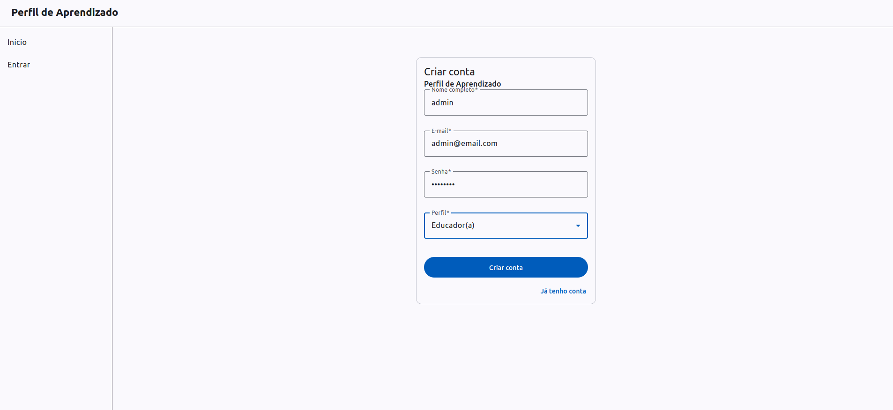 | 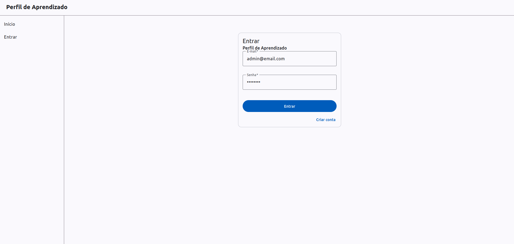 |

| Cadastro de nova conta | Página inicial do admin |
|:---:|:---:|
| 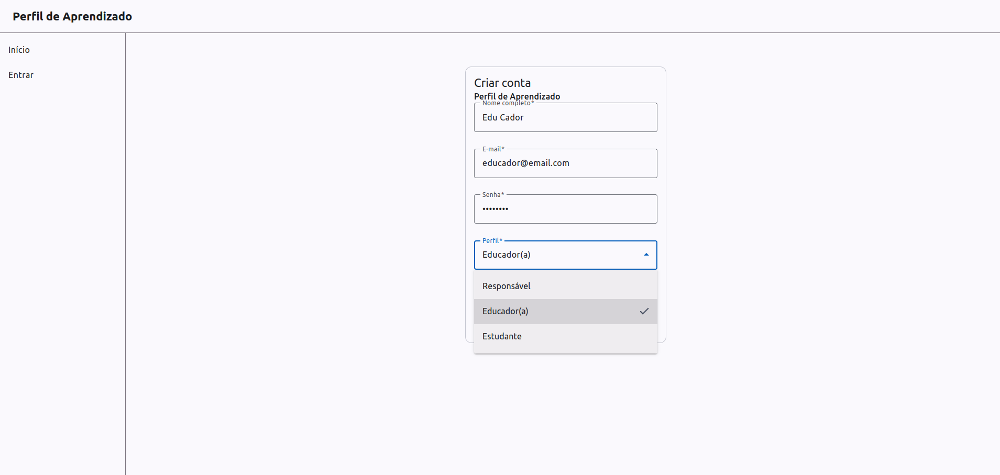 | 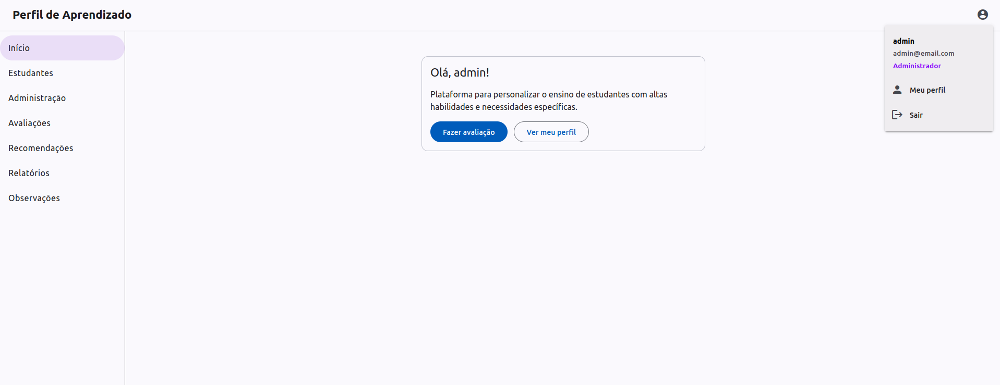 |

**Gestão de usuários**

| Aprovação pendente | Aprovação de usuários |
|:---:|:---:|
| 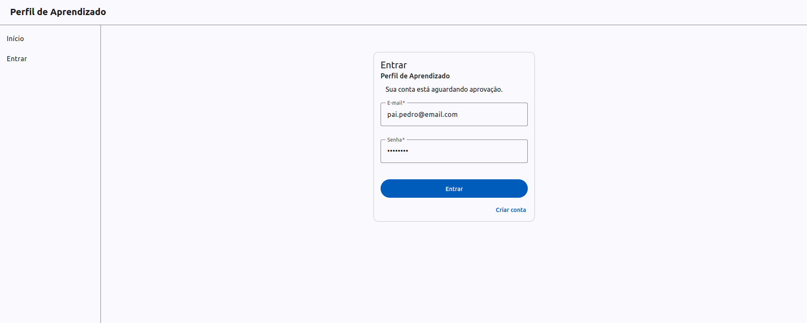 | 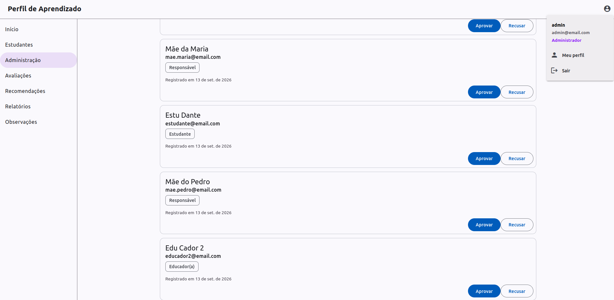 |

| Gerenciamento de usuários (admin) | Visão do educador |
|:---:|:---:|
| 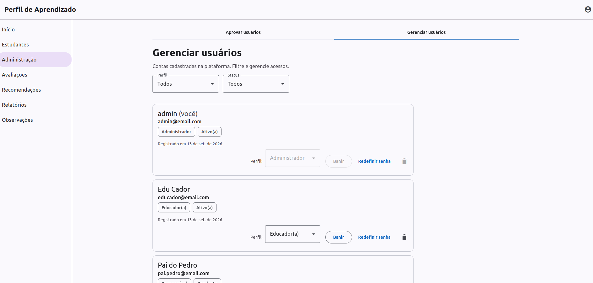 | 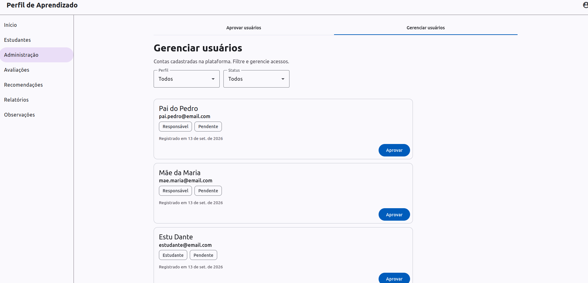 |

**Estudantes**

| Cadastro de estudante (educador) | Listagem de estudantes |
|:---:|:---:|
| 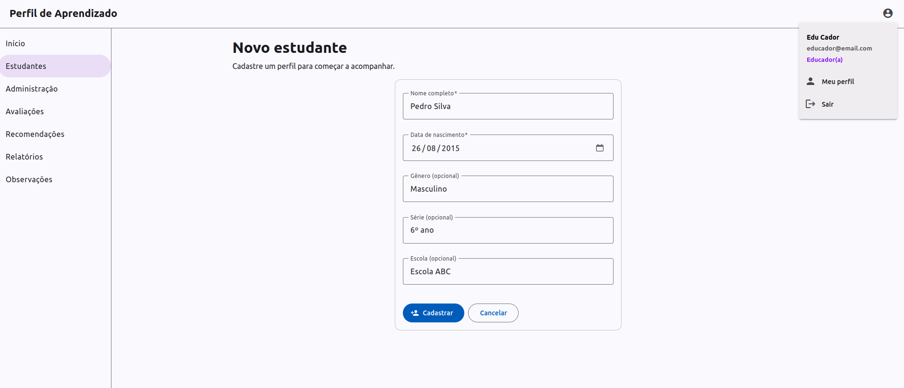 | 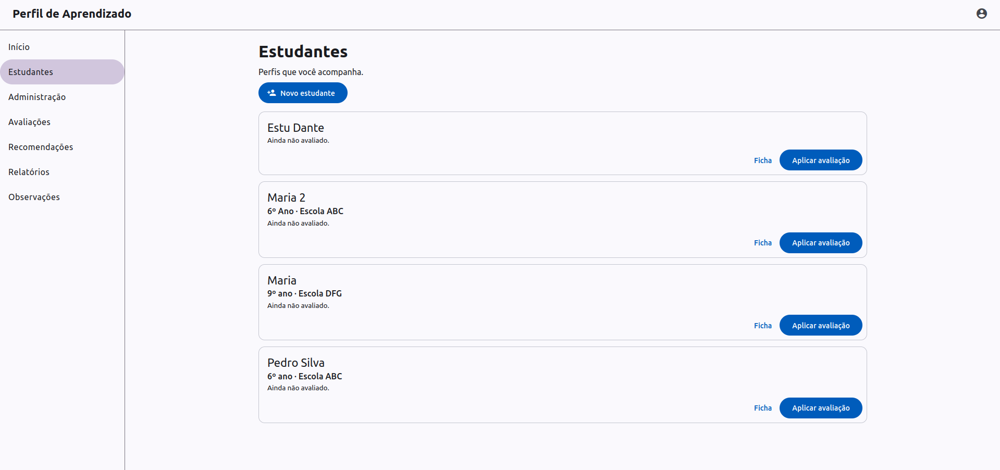 |

| Ficha do estudante | Gerenciamento de acesso |
|:---:|:---:|
| 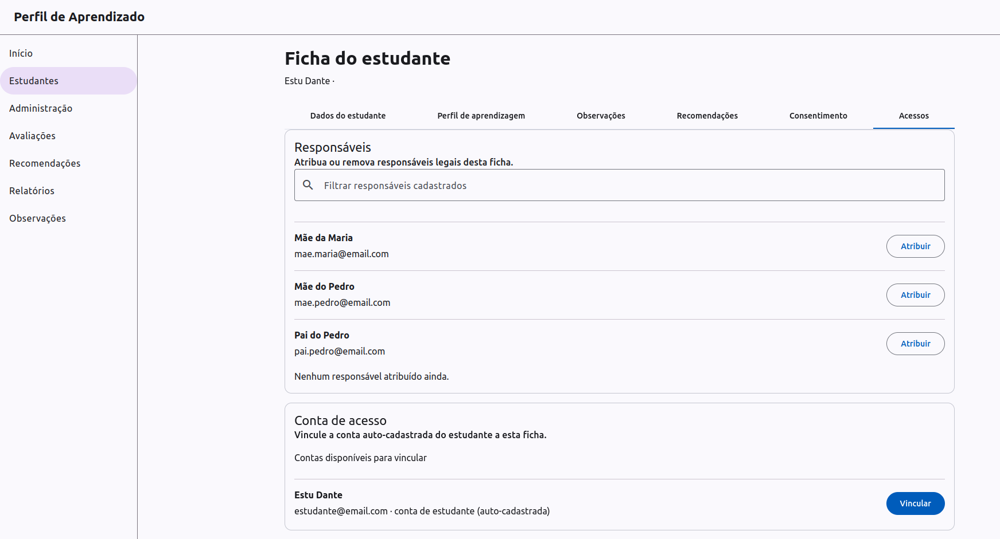 | 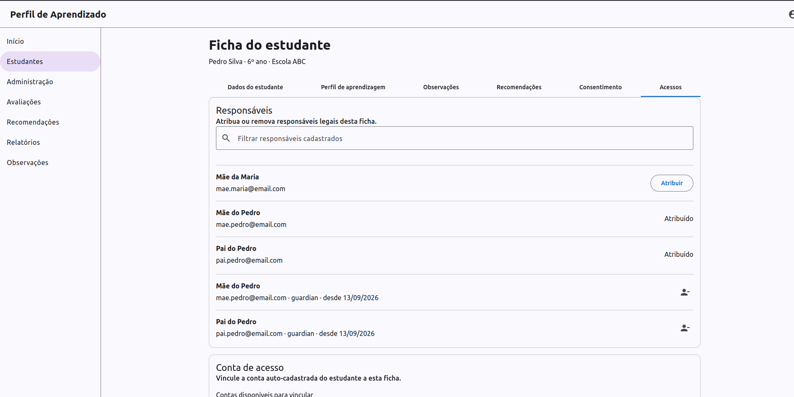 |

| Consentimento (LGPD) |
|:---:|
| 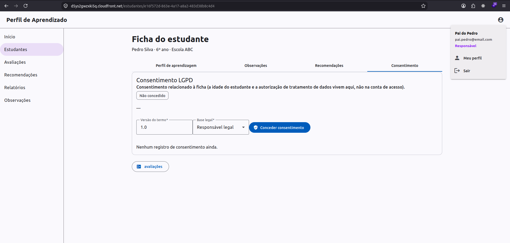 |

**Formulário VARK e predição**

| Seleção de formulário | Seleção do VARK |
|:---:|:---:|
| 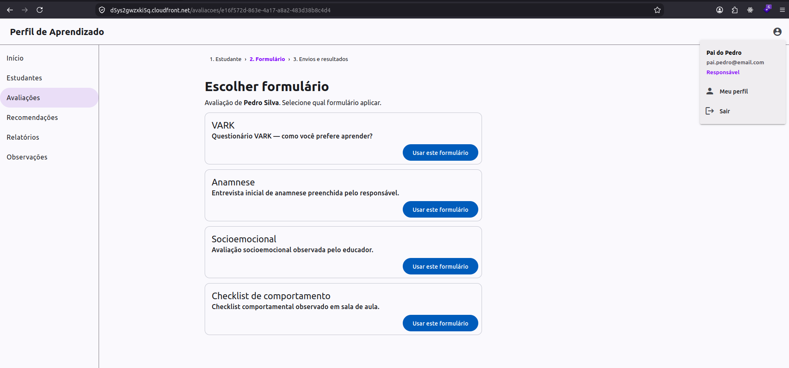 | 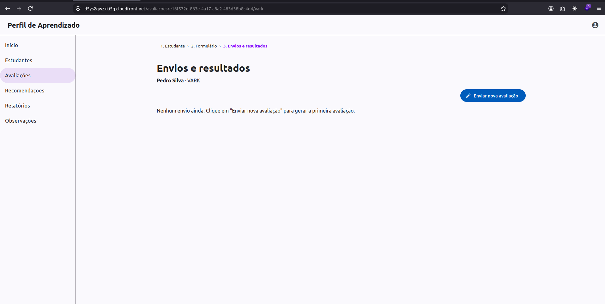 |

| Preenchimento | Envio |
|:---:|:---:|
| 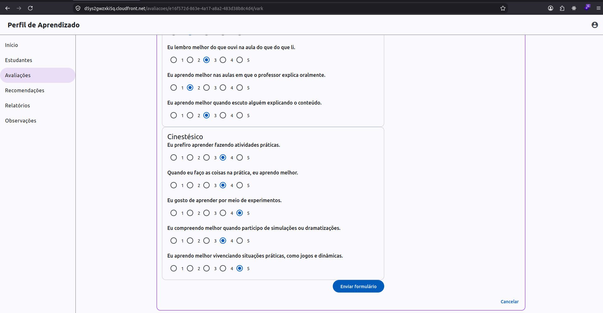 | 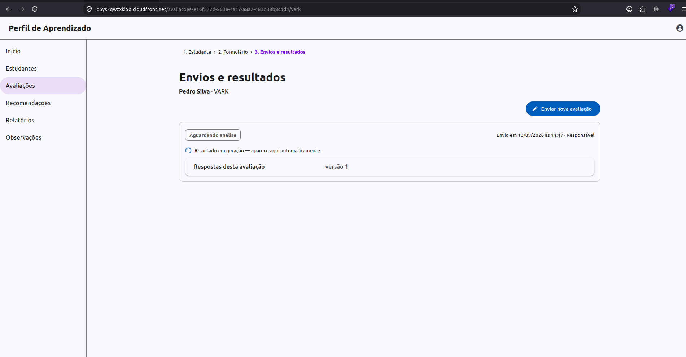 |

| Resultado (perfil + predição) | Integração back → front |
|:---:|:---:|
| 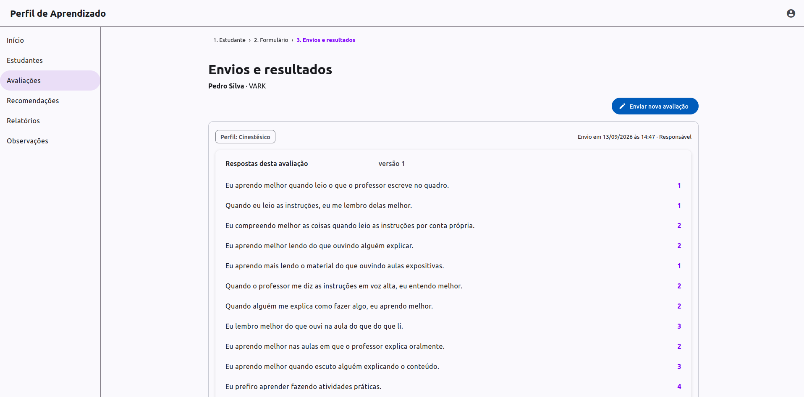 | 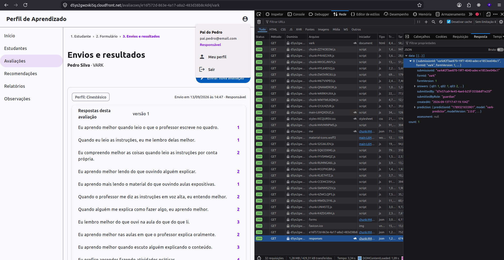 |

---

## Testes

| Tipo | Onde | Como rodar |
|------|------|-----------|
| Unit — backend | `sam-app/tests/unit/` (engine de formulários, schema, VARK, contas) | `cd sam-app && make unit-test` |
| Unit — frontend | `frontend/src/**/*.spec.ts` (API sempre mockada) | `cd frontend && npm test` |
| E2E — backend | `sam-app/tests/e2e/scenarios/` (10 cenários ordenados, contra a API **real**) | `cd sam-app && make e2e-test` · `make e2e-test FILTER=04` |
| Fumaça da inferência | `ml/tests/inference_smoke.py` (vetores extremos pinam o remapeamento de rótulos) | `make smoke` |
| Sanidade do artefato | `ml/serve/sanity.py` | `make sanity` |
| Contrato da API | `specs/api.yaml` | `make validate-api` (Redocly) |

A suíte e2e roda contra o stack implantado (não há emulação local de Lambda/DynamoDB), compartilha estado entre cenários via `ctx` e apaga **apenas** os fixtures que ela mesma cria. Ela **não exige tabela limpa**: se já existir um admin, roda em *staged-admin mode* (promove um educador fixture direto no banco) em vez de exercitar o bootstrap "primeiro educador vira admin". `make clean CONFIRM=yes` (em `sam-app/`) zera a tabela de desenvolvimento.

---

## Comandos

Todos a partir da raiz, via `Makefile`:

```sh
# Deploy
make bootstrap         # uma vez: bucket de estado do Terraform
make deploy-all        # stack completo: aws-app → sam-app → frontend
make deploy-api        # só backend: aws-app → sam-app
make deploy-aws-app    # etapa isolada: infra com estado
make deploy-sam-app    # etapa isolada: Lambdas de API + API Gateway
make deploy-aws-front  # etapa isolada: build da SPA + S3 + invalidação

# Dev
make sync              # sam sync --watch: manda o código dos handlers para as Lambdas em segundos
make frontend-serve    # dev server Angular com proxy /api para a API implantada

# ML (offline)
make train             # prepare + train + evaluate
make package           # empacota model.joblib + meta.json na Lambda de inferência
make sanity            # checagens do artefato
make smoke             # fumaça da inferência

# Validação
make validate-api      # lint do contrato OpenAPI

# Limpeza (ordem inversa)
make destroy-all       # sam delete → terraform destroy (aws-app) → terraform destroy (aws-frontend)
```

No `sam-app/` há atalhos próprios: `make unit-test`, `make e2e-test`, `make e2e-inference` (atalho para `FILTER=inference`), `make clean CONFIRM=yes` (wipe da tabela de dev).

> **Atenção ao destruir**: a tabela DynamoDB e os buckets `files`/`data` são **descartáveis** (dados de teste e exports derivados) e serão apagados; são recriados no próximo `apply`. O bucket de **estado** do Terraform tem `prevent_destroy` e nunca é destruído por engano.

## Segurança e repositório público

Este repositório é **público** — violar estas regras é bloqueador de release (spec completa: [`specs/security.md`](./specs/security.md)):

- **Nunca** commitar segredos (chaves, tokens, senhas, credenciais) — nem comentados ou em fixtures.
- **Nunca** commitar Account ID (12 dígitos) nem ARN que o contenha — use placeholders.
- **Nunca** commitar dados pessoais reais (LGPD): fixtures são fabricados.
- **Nunca** commitar `*.tfstate`, `.env`, `env.json`, `*.pem`/`*.key`, `.venv/`, artefatos crus de ML (`ml/build/`).
- **Exceções deliberadas** (decisão do dono): o **dataset público** (`datasets/vark/data.csv`, CC BY 4.0 com atribuição em `citation.txt`) e os **modelos empacotados** (`sam-app/src/inference/models/<formId>/` — arquivos estáticos treinados só com dados públicos, regenerados por `ml/ make package`).
- Ferramentas: **gitleaks** (`.gitleaks.toml`), **pre-commit** (`.pre-commit-config.yaml`), CI de varredura de segredos (`.github/workflows/secret-scan.yml`) e `terraform validate` em toda mudança de infra.
- No lado da aplicação: bcrypt (custo 12), tokens de `crypto.randomBytes(32)`, TLS em trânsito, S3 com SSE + bloqueio de acesso público e objetos privados servidos só por URL pré-assinada, e nada de analytics/terceiros (restrição LGPD).

## Especificações (specs)

A documentação de arquitetura vive em [`specs/`](./specs/README.md) e é organized como um **DAG de dependências** — cada spec é a fonte da verdade de uma camada, e nada é duplicado:

| Spec | Assunto |
|------|---------|
| [`architecture.md`](./specs/architecture.md) | visão geral, fluxos, decisões de design, ordem de deploy |
| [`dynamodb-schema.md`](./specs/dynamodb-schema.md) | entidades, GSIs, padrões de acesso, transações |
| [`auth.md`](./specs/auth.md) | sessões, papéis, status de conta, escopo, vínculo de conta de estudante |
| [`backend.md`](./specs/backend.md) | endpoints, convenções, matriz de RBAC |
| [`api.yaml`](./specs/api.yaml) | contrato OpenAPI 3.0.3 (SSOT das formas de request/response) |
| [`frontend.md`](./specs/frontend.md) | SPA Angular: rotas, guards, workspace de avaliações, renderer de formulários |
| [`design-system.md`](./specs/design-system.md) | tokens, componentes, baseline de acessibilidade |
| [`ml-pipeline.md`](./specs/ml-pipeline.md) | dataset, features, treino, empacotamento, inferência, loop de re-treino |
| [`lgpd.md`](./specs/lgpd.md) | consentimento, auditoria, retenção, apagamento |
| [`security.md`](./specs/security.md) | regras de segurança e checklist de publicação |
| [`student-data-features.md`](./specs/student-data-features.md) | direção futura: categorização a partir de dados gerais do estudante |
| [`progress.md`](./specs/progress.md) | **status atual e próximos passos** |

[`AGENTS.md`](./AGENTS.md) define as regras para agentes de código (leia antes de contribuir).

## Referências

- **Arquitetura de referência**: [luidsonl/0shared](https://github.com/luidsonl/0shared) — o modelo de auth, upload/download por URL pré-assinada, padrões S3→SQS assíncronos e a integração CloudFormation-export → data source do Terraform vêm de lá.
- **Dataset de treino**: Armand, Eboue (2021), "Student Learning Preferences", Mendeley Data, V1, doi:10.17632/bwrr6zypcj.1 (CC BY 4.0) — commitado em `datasets/vark/data.csv`.
- **Método do perfil**: VARK (Fleming) — ver `specs/architecture.md` e `specs/ml-pipeline.md`.
- **Ciência x prática**: a evidência de que adaptar o ensino a um "estilo fixo" melhora resultados é fraca (a *meshing hypothesis* é amplamente criticada). Os perfis aqui devem ser tratados como **preferências e sugestões**, não rótulos immutable — e o texto do produto precisa dizer isso.
