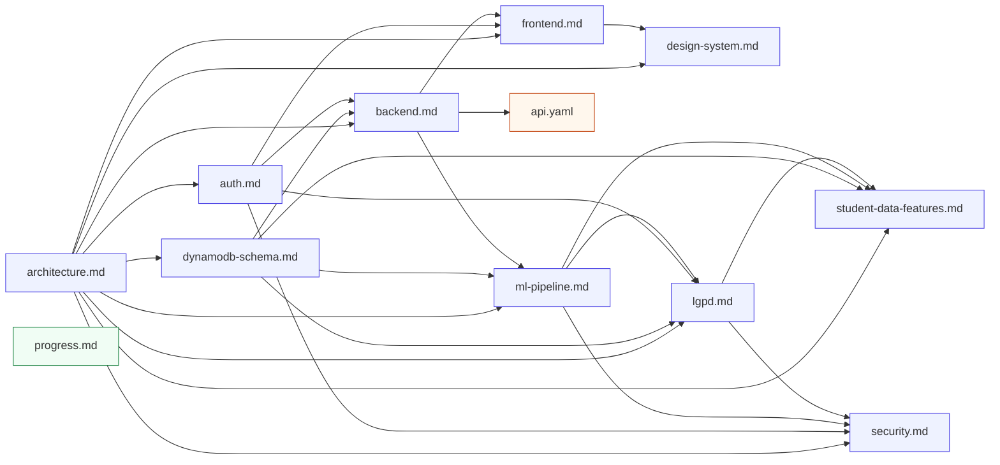

# Specs — Learning Profile Analysis System

> Entry point to the documentation set ("the specs"). Everything here is treated as **living architecture documentation**: each spec is a single source of truth for one layer, cross-linked into a **dependency DAG** so humans and AI agents can navigate it in the right order. `architecture.md` is the root; every other spec builds on it (see [Dependency Graph](#dependency-graph)).

This index is the contract between the codebase and the tools — a coding agent (opencode, Claude Code, Codex, cursor, …) should start here, follow the graph, and never read specs at random or duplicate facts that already live in a spec.

## What do you want to do?

| Task | Start here |
|------|------------|
| Understand the whole system, flows, personas, deployment order | [architecture.md](./architecture.md) |
| Add/change an API endpoint, error handling, RBAC wiring | Read [backend.md](./backend.md) (depends on `architecture`, `dynamodb-schema`, `auth`); the machine-readable contract is [api.yaml](./api.yaml) (depends on `backend`) |
| Add/change a DynamoDB access pattern, entity, GSI, transaction | [dynamodb-schema.md](./dynamodb-schema.md) |
| Change sessions, roles, statuses, scope enforcement, consent gates | [auth.md](./auth.md) |
| Build/navigate the Angular SPA, routes, forms renderer, API client | [frontend.md](./frontend.md) |
| Design tokens, component library, accessibility baseline, themes | [design-system.md](./design-system.md) |
| Retrain/add an ML model, datasets, inference behavior | [ml-pipeline.md](./ml-pipeline.md) |
| Consent lifecycle, retention, erasure, LGPD rights | [lgpd.md](./lgpd.md) |
| Commit-safety / public-repo security rules | [security.md](./security.md) |
| Design future models from general student data | [student-data-features.md](./student-data-features.md) |
| Current status and next steps | [progress.md](./progress.md) |

## Dependency Graph

Arrows go **from prerequisite to dependent**: `A → B` means *"to fully understand B, read A first."* The graph is a strict DAG (no cycles) and is mirrored per-spec in the `dependsOn` / `requiredBy` frontmatter fields. Keep both in sync when editing (see [Consistency](#consistency)).

`progress.md` is a **status report**, not a spec — it deliberately has no edges (it describes the state of every other spec). `api.yaml` is an **OpenAPI 3.0.3 contract** — machine-readable SSOT for HTTP request/response shapes, derived from `backend.md`.

## Spec Registry

| Spec (`id`) | Status | Last reviewed | Depends on |
|-------------|--------|---------------|------------|
| [architecture.md](./architecture.md) (`architecture`) | stable | 2026-09-26 | — |
| [dynamodb-schema.md](./dynamodb-schema.md) (`dynamodb-schema`) | stable | 2026-09-26 | `architecture` |
| [auth.md](./auth.md) (`auth`) | stable | 2026-08-30 | `architecture`, `dynamodb-schema` |
| [backend.md](./backend.md) (`backend`) | stable | 2026-09-26 | `architecture`, `dynamodb-schema`, `auth` |
| [api.yaml](./api.yaml) (`api`) | stable | 2026-09-05 | `backend` |
| [frontend.md](./frontend.md) (`frontend`) | stable | 2026-09-26 | `architecture`, `auth`, `backend` |
| [design-system.md](./design-system.md) (`design-system`) | evolving | 2026-09-26 | `architecture`, `frontend` |
| [ml-pipeline.md](./ml-pipeline.md) (`ml-pipeline`) | stable | 2026-09-26 | `architecture`, `dynamodb-schema`, `backend` |
| [lgpd.md](./lgpd.md) (`lgpd`) | stable | 2026-08-30 | `architecture`, `dynamodb-schema`, `auth`, `ml-pipeline` |
| [security.md](./security.md) (`security`) | stable | 2026-09-26 | `architecture`, `auth`, `ml-pipeline`, `lgpd` |
| [student-data-features.md](./student-data-features.md) (`student-data-features`) | proposed | 2026-08-29 | `architecture`, `dynamodb-schema`, `ml-pipeline`, `lgpd` |
| [progress.md](./progress.md) (`progress`) | evolving | 2026-09-26 | — (report) |

## Status Legend

| Status | Meaning |
|--------|---------|
| `stable` | Implemented, verified against the code, safe to build on |
| `evolving` | Actively changing (planned, partially implemented, or a work-in-progress spec that tracks reality) |
| `proposed` | Not implemented — future direction, captured to guide design decisions (e.g. `student-data-features`) |
| `deprecated` | Superseded — keep only with a link to the spec that replaced it |

## Consistency

These rules keep the set coherent for both human readers and AI agents. Treat them like lint for docs.

1. **Single source of truth (SSOT / DRY).** Every cross-cutting fact lives in exactly **one** spec: resource names & flows → `architecture`; entities/GSIs/transactions → `dynamodb-schema`; roles/statuses/scope → `auth`; endpoints → `backend` (contract details → `api.yaml`); consent/retention → `lgpd`; dataset/model policy → `ml-pipeline`. Other specs **link, never duplicate**. If a fact appears in two specs it has no owner — pick one home and reference it.
1. **Language.** Every spec, contract (`api.yaml`), code comment, commit message and doc is written in **English**. `pt-BR` appears **only** in end-user-facing UI copy and domain data (e.g. form question texts served by the forms engine) and in the **root `README.md`**, which is the human-facing pt-BR overview of the project — never in specs, the OpenAPI contract, comments, or documentation files.
2. **Frontmatter is the contract.** Every spec opens with a YAML block: `id` (matches filename), `title`, `type` (`spec`|`report`), `status`, `since`, `lastReviewed`, and the edges `dependsOn` / `requiredBy`. Edges must be **inverse-consistent**: `X.dependsOn` contains Y ⇔ `Y.requiredBy` contains X. The graph above is derived from these fields — a new spec must be added to this index *and* the Mermaid graph at the same time it is created.
3. **Link first, explain after.** Cross-spec references use relative links (`./auth.md`). When a spec needs another's content, reference it and summarize only the essential context — never restate the source.
4. **Read order is encoded, not implied.** `dependsOn` means "read these before this, they're prerequisites." Reviewers and agents follow the graph bottom-up; a change to a spec implicitly risks its `requiredBy` dependents.

## Changing a spec (lifecycle)

Specs are living documents, but changes are deliberate — same PR discipline as code:

1. **Find dependents first.** Changing facts (schema, roles, endpoints, retention) ripples downstream per `requiredBy`. Grep the codebase too: docs must match code.
2. **Bump the metadata.** Set `status` (`stable` → `evolving` while churning → back to `stable`), update `lastReviewed` to today, and adjust `dependsOn`/`requiredBy` if the *relationships* changed.
3. **Additive changes are cheap.** New forms, endpoints, entities, and models follow the *extend-by-addition* pattern in `architecture.md` and `ml-pipeline.md`; they rarely invalidate dependents.
4. **Breaking changes update the graph.** If a spec is superseded, mark it `deprecated` and link onward; never delete a spec that has `requiredBy` references.
5. **Log the drift.** `progress.md` records cumulative status; design decisions ("why") stay in `architecture.md` → *Key Design Decisions* (future ADRs go in `specs/decisions/`).
6. **AI agents:** follow this lifecycle when editing specs — never silently edit a fact without checking `requiredBy` and bumping `lastReviewed`.